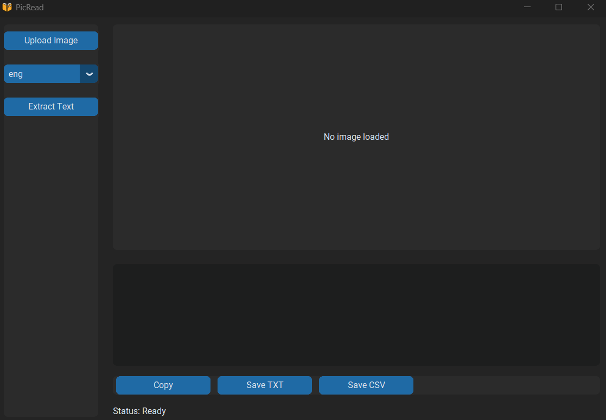
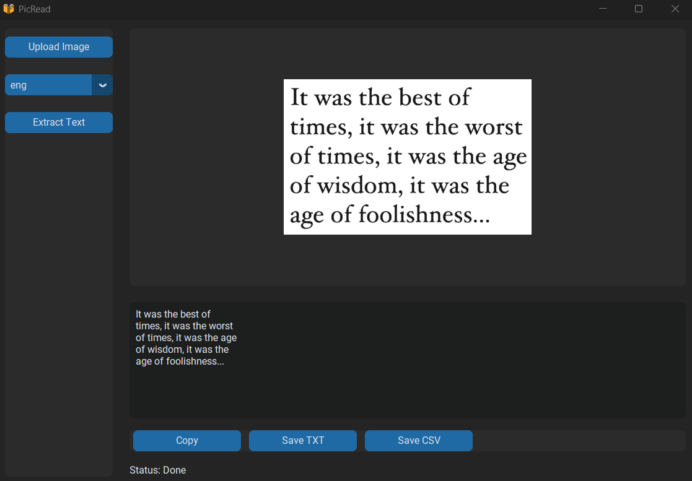
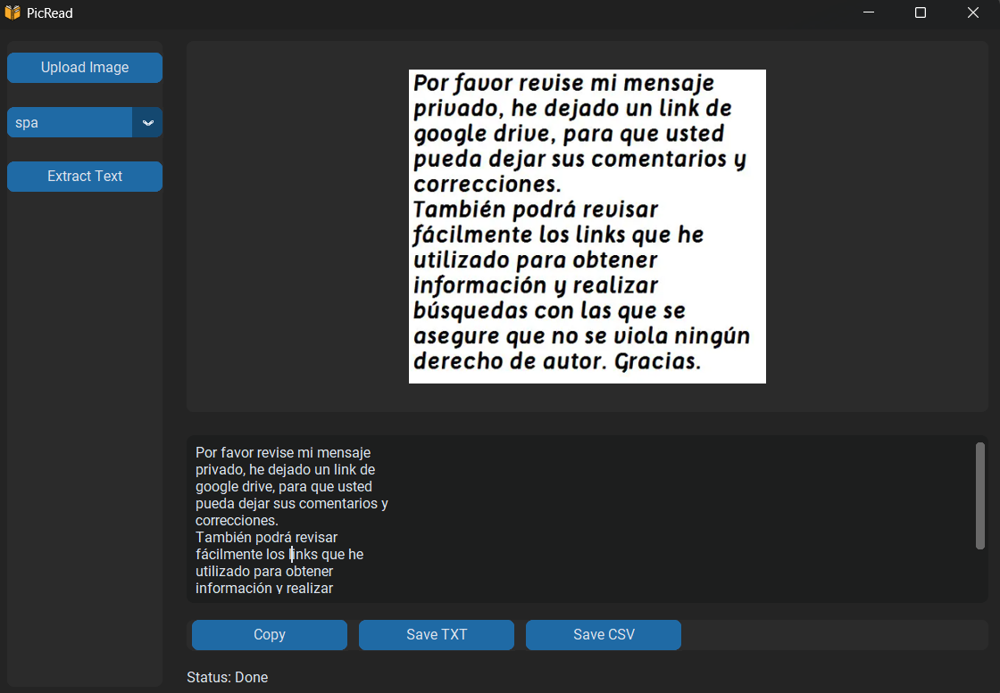

# PicRead — Screenshot to Text (OCR)

PicRead is a simple desktop application that extracts text from images (screenshots, photos) using OCR (Tesseract).

Built with Python + CustomTkinter, focused on clean UI and real usability.

---

## Features

* Upload image (PNG, JPG, JPEG)
* Image preview inside app
* OCR text extraction
* Language selection:

  * English (ENG)
  * Polish (PL)
  * Spanish (ES)
* Editable output textbox
* Copy text to clipboard
* Save as TXT
* Save as CSV
* Error handling (missing file, missing language, no text)

---

## Screenshots

### Main UI

### OCR Result

### Language Selection

---

## Tech Stack

* Python
* CustomTkinter
* pytesseract
* Pillow

---

## Installation

### 1. Clone repository

git clone https://github.com/czuameni/picread.git
cd PicRead

---

### 2. Install dependencies

pip install -r requirements.txt

---

### 3. Install Tesseract OCR

Download from:
https://github.com/UB-Mannheim/tesseract/wiki

After installation, make sure this file exists:

C:\Program Files\Tesseract-OCR\tesseract.exe

---

### 4. Set Tesseract path in code

In main.py add:

pytesseract.pytesseract.tesseract_cmd = r"C:\Program Files\Tesseract-OCR\tesseract.exe"

---

### 5. Run the application

python main.py

---

## Language Support

Tesseract requires language files.

Make sure you have:

* eng (English)
* pol (Polish)
* spa (Spanish)

---

## Build EXE

pip install pyinstaller
pyinstaller --onefile --windowed --icon=icon.ico main.py

Executable will be created in:

dist/

---

## Project Structure

PicRead/
│
├── main.py
├── requirements.txt
├── icon.ico
├── screenshots/
│   ├── main.png
│   ├── result.png
│   └── language.png
└── README.md

---

## Notes

* Tesseract must be installed separately
* OCR accuracy depends on image quality
* Works best with clear, high-contrast images

---

## Future Improvements

* Drag & Drop support
* Batch OCR (multiple images)
* Auto language detection
* Image preprocessing for better accuracy

---

## 📄 License

MIT License
